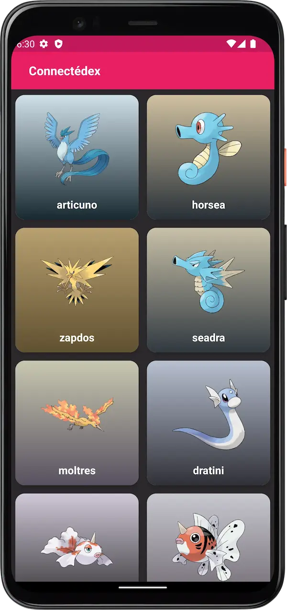
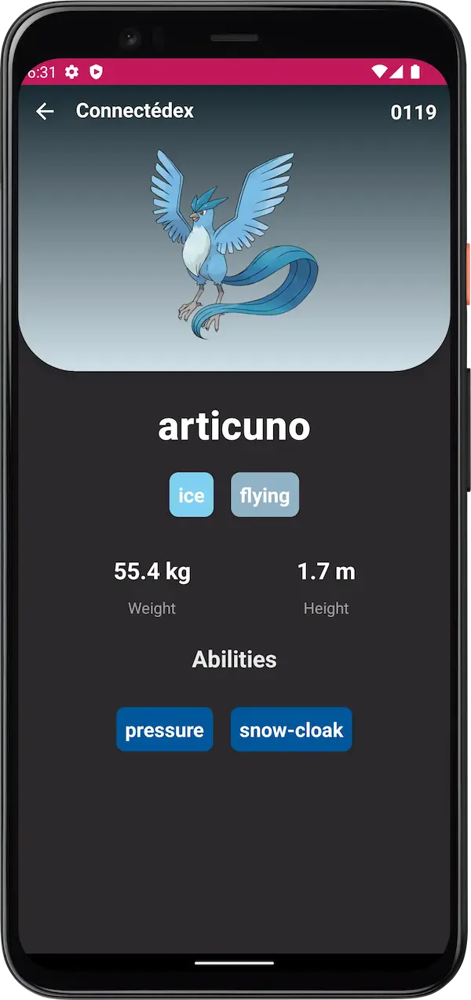

# Connectédex
## A Pokédex built for educational purposes

| **List View** | **Detail View** |
|----------|------------|
|||
----------------------------------------------------------------------------------------------------------------------------------------------------------------------------

## Technologies used:
- [Kotlin & Kotlin Coroutines](https://kotlinlang.org/)
- [Apollo GraphQL for Kotlin](https://apollographql.com/)
- [Glide for Kotlin](https://bumptech.github.io/glide/)
- [Material Components](https://material.io/)
- [R8](https://r8.dev/)
- Creature data sourced from [PokeAPI](https://graphql-pokeapi.graphcdn.app)

Copyright 2022 Shaun McDonald

Licensed under the Apache License, Version 2.0 (the "License");
you may not use this file except in compliance with the License.
You may obtain a copy of the License at

    http://www.apache.org/licenses/LICENSE-2.0

Unless required by applicable law or agreed to in writing, software
distributed under the License is distributed on an "AS IS" BASIS,
WITHOUT WARRANTIES OR CONDITIONS OF ANY KIND, either express or implied.
See the License for the specific language governing permissions and
limitations under the License.

